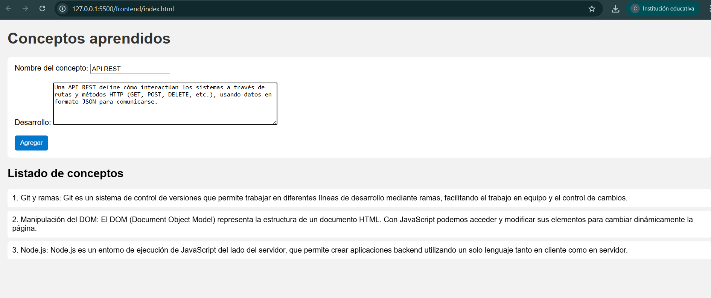
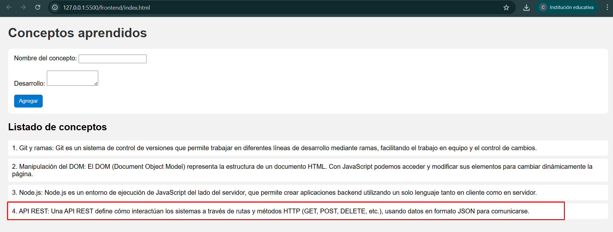
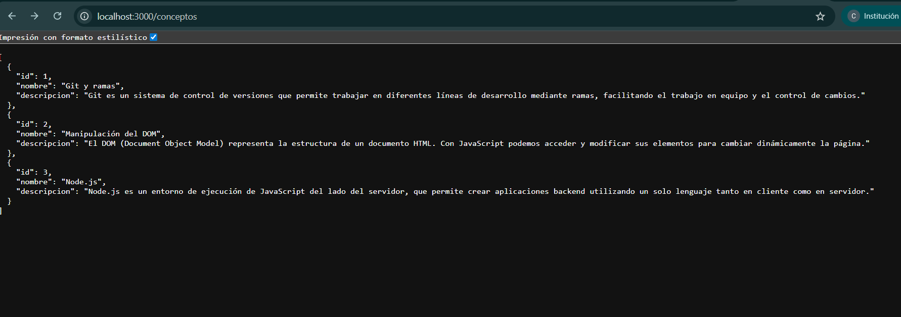
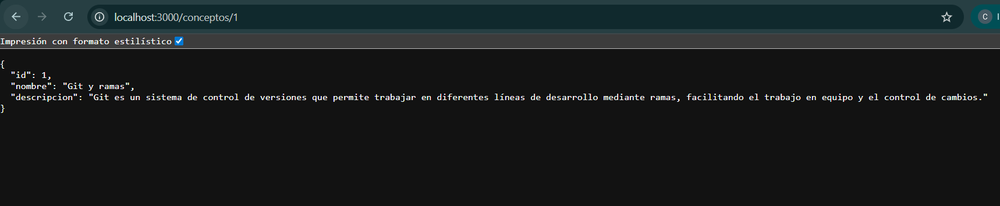
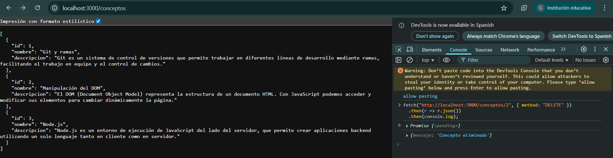
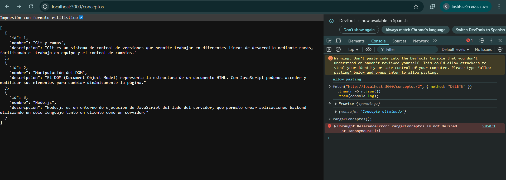
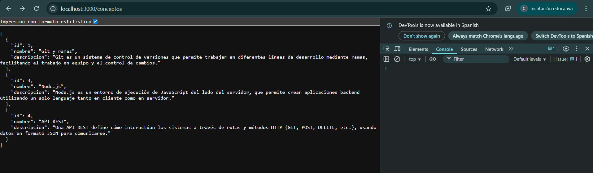
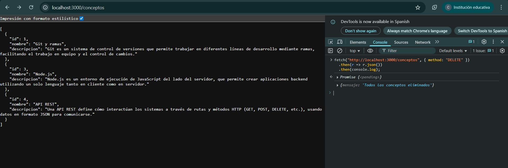
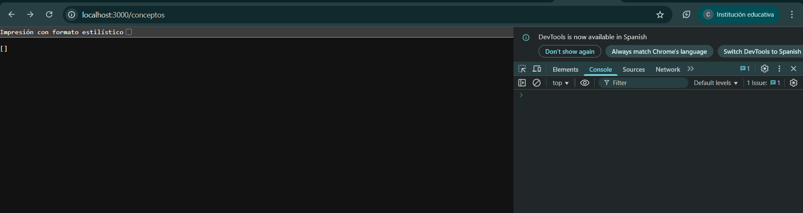

# Trabajo Práctico N°1 – Taller de Programación 2
**Alumno:** Catalina Guitelman  
**Materia:** Taller de Programación 2  
**Profesor:** Franco Borsani  
**Entrega:** 16/09/2025  

---

## Objetivo
Desarrollar una aplicación básica con Node.js como backend, utilizando los conceptos vistos en clase: manejo de GIT, DOM, Node.js, API REST y VSC.

---

## Funcionalidades
- Ingreso de conceptos con nombre y descripción desde un formulario.
- Visualización de conceptos en la interfaz.
- API REST con las siguientes rutas:
  - `GET /conceptos`: obtiene todos los conceptos.
  - `GET /conceptos/:id`: obtiene un concepto por ID.
  - `POST /conceptos`: agrega un concepto.
  - `DELETE /conceptos`: elimina todos los conceptos.
  - `DELETE /conceptos/:id`: elimina un concepto específico.

---

## Estructura del proyecto
TallerTP1/
│
├── frontend/
│ ├── index.html
│ ├── style.css
│ └── script.js
│
├── backend/
│ └── server.js
│
├── img/
│
├── node_modules
│
│
└── README.md

---

## Cómo ejecutar
1. Instalar Node.js.  
2. Entrar en la carpeta `TP1`, abrir bash y correr npm start

## Caso 1 – Agregar concepto

Acción: Completar formulario con nombre concepto y descripción.
Resultado esperado: Aparece en la lista.

## Caso 2 – Ver todos

Acción: Añadir /conceptos en navegador luego de http://localhost:3000/.
Resultado esperado: JSON con todos los conceptos.

## Caso 3 - Ver por ID
Acción: Añadir /conceptos/1 en navegador luego de http://localhost:3000/.
Resultado esperado: JSON con los datos del concepto 1.

## Caso 4 – Eliminar un concepto

Acción: Ingresar siguiente código en consola de navegador
fetch("http://localhost:3000/conceptos/2", { method: "DELETE" })
  .then(r => r.json())
  .then(console.log);
Resultado esperado: Elimina el concepto con id=2.

## Caso 5 - Eliminar todos los conceptos

Accion: Ingresar siguiente código en consola de navegador
fetch("http://localhost:3000/conceptos", { method: "DELETE" })
  .then(r => r.json())
  .then(console.log);
Resultado esperado: Elimina todos los conceptos

## Conclusiones

Aprendizaje: Pude entender cómo funciona un backend sin librerías externas, manejando rutas manualmente.
Dificultad: 
1. El manejo del CORS y el parsing del body fueron complicados al principio, pero se resolvieron leyendo la documentación y probando casos.
2. Me pasó varias veces que no podía pushear porque el repo remoto ya tenía un README o porque las ramas (main y dev) no coincidían.
3. Me costó encontrar cómo probar los DELETE y terminé haciéndolo con fetch desde el navegador.
4. También me confundí con el mensaje de “Ruta no encontrada” hasta que entendí que era porque estaba entrando a / en lugar de /conceptos.
5. No entendía qué era y para qué servía npm, usaba node por la mitad.